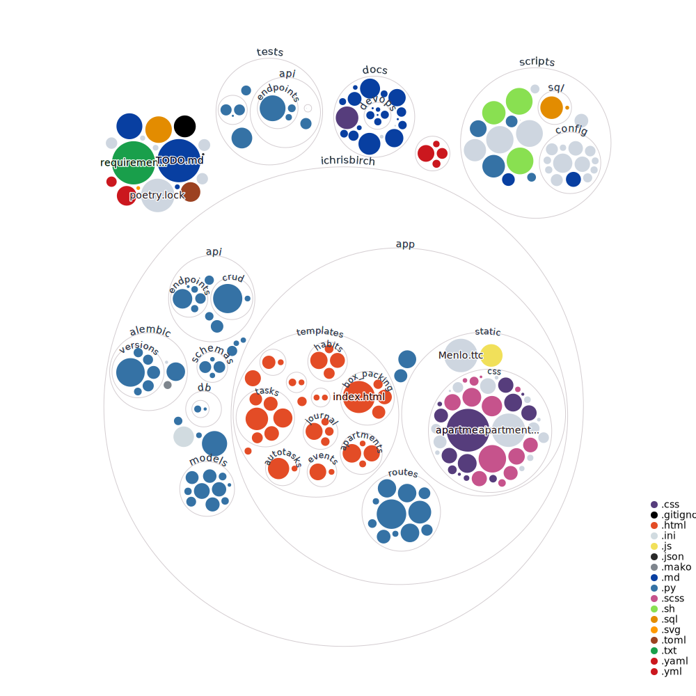

# iChrisBirch

## Project Goals

1. Fully tested, practice a version of TDD
2. Test the frontend as well
3. Structured Logging, based on modules
4. Zero downtime deployments
5. Reproducible from server to server
6. Performance Tested
7. Documentation serving as learning points
8. Integration and trial of advanced features
9. Upgrade frontend to a modern framework (typescript maybe/probably)

## Roadmap

[TODO](TODO.md)
