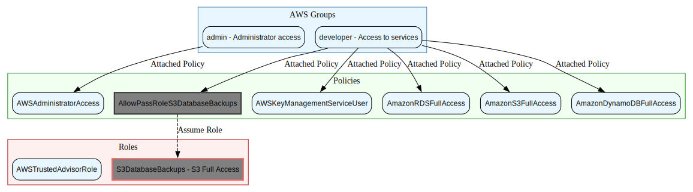

# AWS

## IAM

### Groups

`admin` - Administrator access
`developer` - Access to services

- GROUP: `admin`
  - POLICY: `AWSAdministratorAccess`
- GROUP: `developer` group has POLICIES
  - POLICY: `AllowPassRoleS3DatabaseBackups`
    - Allow to assume the `S3DatabaseBackups` ROLE
      - ROLE: `S3DatabaseBackups` - S3 Full Access
  - POLICY: `AWSKeyManagementServiceUser`
    - Allow to view and use all KMS keys
    - Allow grant to AWSResources (like S3)
  - POLICY: `AmazonRDSFullAccess`
  - POLICY: `AmazonS3FullAccess`
  - POLICY: `AmazonDynamoDBFullAccess`
- ROLE: `AWSTrustedAdvisorRole`

## EC2

### ichrisbirch instances

US East 1
Security Group: ichrisbirch-sg
Key name: ichrisbirch-webserver
Ubuntu 22.04
