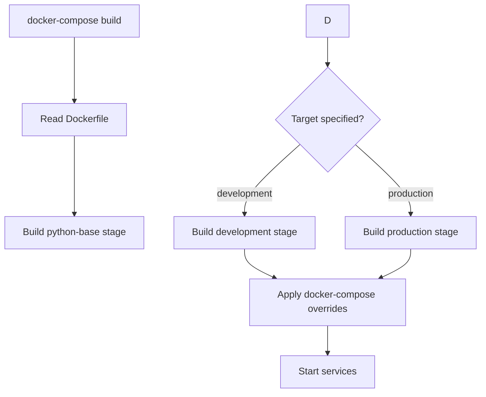

# Docker Architecture and Build Process

This document explains the Docker architecture for the ichrisbirch application, including multi-stage builds, environment-specific configurations, and integration with Docker Compose.

- [Overview](#overview)
- [Dockerfile Architecture](#dockerfile-architecture)
  - [Multi-Stage Build Strategy](#multi-stage-build-strategy)
  - [Why Multi-Stage?](#why-multi-stage)
- [Build Stages](#build-stages)
  - [1. Python Base Stage (`python-base`)](#1-python-base-stage-python-base)
  - [2. Builder Stage (`builder`)](#2-builder-stage-builder)
  - [Production Environment](#production-environment)
  - [docker-compose.prod.yml](#docker-composeprodyml)
- [Environment File Integration](#environment-file-integration)
- [Build Commands](#build-commands)
  - [Direct Docker Build](#direct-docker-build)
  - [Docker Compose Build](#docker-compose-build)
  - [Convenience Scripts](#convenience-scripts)
- [Service-Specific Commands](#service-specific-commands)
  - [Multiple Services from One Image](#multiple-services-from-one-image)
  - [Why One Dockerfile for Multiple Services?](#why-one-dockerfile-for-multiple-services)
- [Best Practices](#best-practices)
  - [1. Layer Caching](#1-layer-caching)
  - [4. Development Experience](#4-development-experience)
  - [Common Issues](#common-issues)
    - [4. Development Hot-Reload Not Working](#4-development-hot-reload-not-working)
  - [Check running processes](#check-running-processes)
  - [View logs](#view-logs)
  - [Check environment variables](#check-environment-variables)
- [Performance Optimization](#performance-optimization)
- [Summary](#summary)

## Overview

The ichrisbirch application uses a **multi-stage Docker build** approach that creates optimized images for different environments:

- **Development**: Full development environment with hot-reload and debugging tools
- **Production**: Minimal, security-hardened runtime environment
- **Testing**: Containerized testing environment with all dependencies

All three environments share the same base image and dependencies but differ in configuration, installed packages, and runtime commands.

## Dockerfile Architecture

### Multi-Stage Build Strategy

```dockerfile
# Stage 1: python-base (shared foundation)
FROM python:3.12-slim as python-base

# Stage 2: builder (dependency compilation)
FROM python-base as builder

# Stage 3: development (dev tools + hot reload)
FROM python-base as development

# Stage 4: production (minimal runtime)
FROM python-base as production
```

### Why Multi-Stage?

1. **Shared Base**: All stages share the same Python runtime and basic configuration
2. **Build Isolation**: Compilation tools are only in the builder stage
3. **Size Optimization**: Production images exclude development dependencies
4. **Security**: Production images have minimal attack surface
5. **Consistency**: Same base ensures identical runtime behavior

## Build Stages

### 1. Python Base Stage (`python-base`)

```dockerfile
FROM python:3.12-slim as python-base
```

**Purpose**: Establishes the foundation for all other stages

**Key Features**:

**Environment Variables**:

```dockerfile
    PYTHONDONTWRITEBYTECODE=1 \
    PIP_NO_CACHE_DIR=1 \
    POETRY_VERSION=1.8.3 \
    POETRY_HOME="/opt/poetry" \
    APP_PATH="/app"
```

### 2. Builder Stage (`builder`)

```dockerfile

**Purpose**: Compiles dependencies and creates the virtual environment

```

```dockerfile

FROM python-base as development
```

**Key Features**:

- Copies virtual environment from builder

**Development-Specific**:

```dockerfile
RUN poetry install --no-root  # Includes dev dependencies
### 4. Production Stage (`production`)
FROM python-base as production
```

**Key Features**:

- Only runtime dependencies (no build tools)
- Minimal system packages

- Security optimizations

```dockerfile
RUN poetry install --only=main --no-root  # No dev dependencies
CMD ["gunicorn", "ichrisbirch.wsgi_api:api", "--bind", "0.0.0.0:8000", "--worker-class", "uvicorn.workers.UvicornWorker", "--workers", "4"]

## Environment Configurations


### Development Environment


**Image Target**: `development`


- Hot-reload enabled

- Volume mounts for live code editing


# docker-compose.dev.yml
services:
  api:

      context: .


    command: uvicorn ichrisbirch.wsgi_api:api --host 0.0.0.0 --port 8000 --reload
    volumes:
      - .:/app
```

### Production Environment

**Image Target**: `production`

**Characteristics**:

- Security hardening
- Health checks
**Docker Compose Usage**:

### docker-compose.prod.yml

  api:
      context: .
      target: production
    command: gunicorn ichrisbirch.wsgi_api:api --bind 0.0.0.0:8000 --worker-class uvicorn.workers.UvicornWorker --workers 4

```yaml


### Testing Environment

**Image Target**: `development` (with test configuration)
**Characteristics**:

- Same as development but with test configuration

- Test-specific environment variables
- Isolated test networks

## Docker Compose Integration


### How Docker Compose Uses the Dockerfile

Docker Compose extends the Dockerfile with:


1. **Target Selection**: Chooses which stage to build
2. **Environment Variables**: Injects configuration via `.env` files
3. **Volume Mounts**: Overlays source code for development
4. **Network Configuration**: Connects services
5. **Command Overrides**: Customizes startup commands

### Build Process Flow


## Environment File Integration

Each environment uses its own `.env` file:

```bash
# Development
docker-compose --env-file .dev.env -f docker-compose.yml -f docker-compose.dev.yml up

# Testing
docker-compose --env-file .test.env -f docker-compose.yml -f docker-compose.test.yml up

# Production
docker-compose --env-file .prod.env -f docker-compose.yml -f docker-compose.prod.yml up
```

## Build Commands

### Direct Docker Build

```bash
# Build development image
docker build --target development -t ichrisbirch:dev .

# Build production image
docker build --target production -t ichrisbirch:prod .

# Build with build arguments
docker build --target production --build-arg POETRY_VERSION=1.8.3 -t ichrisbirch:prod .
```

### Docker Compose Build

```bash
# Build development environment
docker-compose -f docker-compose.yml -f docker-compose.dev.yml build

# Build production environment
docker-compose -f docker-compose.yml -f docker-compose.prod.yml build

# Build with no cache
docker-compose -f docker-compose.yml -f docker-compose.dev.yml build --no-cache
```

### Convenience Scripts

```bash
# Development
./scripts/dev-start.sh

# Testing
./scripts/test-run.sh

# Production (manual)
docker-compose --env-file .prod.env -f docker-compose.yml -f docker-compose.prod.yml up -d
```

## Service-Specific Commands

### Multiple Services from One Image

The same Docker image can run different services by overriding the command:

```yaml
# docker-compose.yml
services:
  # FastAPI Backend
  api:
    build: .
    command: uvicorn ichrisbirch.wsgi_api:api --host 0.0.0.0 --port 8000

  # Flask Frontend
  app:
    build: .
    command: flask --app ichrisbirch.wsgi_app:app run --host 0.0.0.0 --port 5000


  # Scheduler
  scheduler:
    build: .
    command: python -m ichrisbirch.wsgi_scheduler
```

### Why One Dockerfile for Multiple Services?

1. **Consistency**: Same dependencies and runtime environment
2. **Efficiency**: Single build process, shared layers
3. **Maintainability**: One file to update for all services
4. **Resource Optimization**: Shared base images reduce storage

## Best Practices

### 1. Layer Caching

Dependencies are installed before copying source code:

```dockerfile
COPY pyproject.toml poetry.lock* ./


COPY --chown=appuser:appuser ichrisbirch/ ./ichrisbirch/
```

- Non-root user for all processes

- Proper file permissions

- Multi-stage builds exclude build dependencies from production
- Cleanup package caches after installation

### 4. Development Experience

- Volume mounts for live code editing

### Common Issues

```bash
# Rebuild without cache
docker-compose build --no-cache
# Check Poetry version
docker run --rm ichrisbirch:dev poetry --version


**Solution**:
```dockerfile
# Or fix permissions

docker run --rm ichrisbirch:dev python -c "import psycopg2; print('OK')"

# Verify service communication
docker-compose exec api ping postgres
```

#### 4. Development Hot-Reload Not Working

**Error**: Changes not reflected in running container

**Solution**: Verify volume mounts in docker-compose.dev.yml:

```yaml
volumes:
  - .:/app
  - /app/.venv  # Exclude virtual environment
```

### Check running processes

```bash
docker-compose exec api ps aux
```

### View logs

```bash
docker-compose exec api bash
```

### Check environment variables

```bash
docker-compose exec api env | grep -E "(POSTGRES|REDIS|FASTAPI)"
```

## Performance Optimization

```bash
# Clean up unused images
docker system prune -a

# Check image sizes
docker images --format "table {{.Repository}}\t{{.Tag}}\t{{.Size}}"
```

## Summary

This Docker architecture provides:

- **Flexibility**: Same image, different configurations
- **Security**: Non-root execution, minimal attack surface
- **Efficiency**: Multi-stage builds, layer caching
- **Consistency**: Identical environments across development, testing, and production

- **Maintainability**: Single Dockerfile for all services

The integration with Docker Compose allows for easy environment switching while maintaining consistency in the underlying application runtime.
