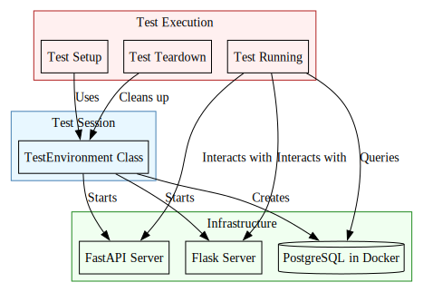
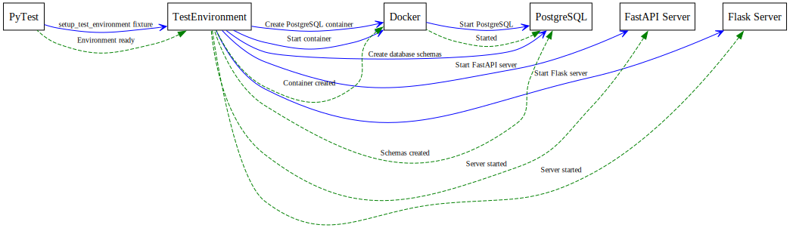
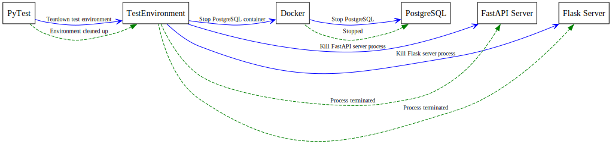

# Test Environment Configuration

This document details how the test environment is configured, set up, and managed in the ichrisbirch project's testing infrastructure.

## Environment Architecture

The test environment consists of several interconnected components:



## TestEnvironment Class

The `TestEnvironment` class in `tests/environment.py` is responsible for setting up and tearing down the test environment. It:

1. Creates a PostgreSQL container in Docker
2. Starts the FastAPI server in a separate process
3. Starts the Flask server in a separate process
4. Creates necessary database schemas
5. Manages the lifecycle of these components

### Environment Setup Process

The setup process follows these steps:



### Environment Teardown Process

The teardown process follows these steps:



## Docker Container Management

The test environment uses Docker to provide a clean, isolated PostgreSQL database for testing:

### PostgreSQL Container

- **Image**: postgres:16
- **Environment**:
  - POSTGRES_USER: Set from test settings
  - POSTGRES_PASSWORD: Set from test settings
  - POSTGRES_DB: Set from test settings
- **Ports**: Maps container port 5432 to host port specified in test settings
- **Lifecycle**: Created and started during test setup, stopped during test teardown

## Server Processes

### FastAPI Server

- **Start Command**:

  ```bash
  poetry run uvicorn tests:test_env.api --host <host> --port <port> --log-level debug
  ```

- **Configuration**:
  - Host: Set from test settings
  - Port: Set from test settings
  - Application: Uses a FastAPI application with test dependencies

### Flask Server

- **Start Command**:

  ```bash
  poetry run gunicorn tests.wsgi_test:application --bind <host>:<port> --log-level DEBUG
  ```

- **Configuration**:
  - Host: Set from test settings
  - Port: Set from test settings
  - Application: Uses a Flask application with test configuration
  - Timeout: 120 seconds (extended for testing)
  - Logging: Captures and redirects stdout/stderr

## Test Settings

Test settings are managed through a dedicated settings mechanism:

- **Environment**: Testing environment is set via environment variables
- **Settings Function**: `get_test_settings()` provides test-specific settings
- **Overrides**: Test-specific overrides for database connections, server hosts/ports, etc.

## Test Database

- **Database Name**: Set from test settings
- **Schemas**: Created according to settings.db_schemas
- **Connection**: Uses SQLAlchemy with test connection parameters
- **Session**: Uses `TestSessionLocal` session factory

## Dependency Overrides

FastAPI's dependency injection system is used to override production dependencies with test versions:

```python
# Override the database session
api.dependency_overrides[get_sqlalchemy_session] = get_testing_session

# Override user authentication for testing
api.dependency_overrides[get_current_user] = lambda: test_user
```

## Docker Utilities

Helper functions in `tests/utils/docker.py` manage Docker operations:

- `get_docker_client()`: Creates a Docker client
- `create_postgres_docker_container()`: Creates a PostgreSQL container
- `docker_logs()`: Streams Docker container logs

## Environment Variables

Testing relies on specific environment variables:

- `ENVIRONMENT`: Set to 'testing' for test execution
- Additional variables defined in test settings

## Test Isolation

The test environment ensures isolation through:

1. A dedicated Docker container for the database
2. Separate server processes for API and App
3. Clean database setup for each test module
4. Test-specific settings and configurations

## Installation Requirements

To run the test environment, you need:

1. Docker installed and running
2. Poetry for Python package management
3. Ports available as specified in test settings
4. Host entries for API and App servers (see [testing.md](testing.md))

## Common Issues and Solutions

1. **Docker Connection Issues**:
   - Ensure Docker daemon is running
   - Check Docker permissions

2. **Port Conflicts**:
   - Change ports in test settings if there are conflicts
   - Check for other processes using the same ports

3. **Database Connection Issues**:
   - Verify Docker container is running
   - Check database credentials in test settings
   - Ensure PostgreSQL has started within the container

4. **Server Startup Issues**:
   - Check server logs for errors
   - Verify dependencies are installed
   - Ensure ports are available

5. **Test Data Issues**:
   - Check for schema creation errors
   - Verify test data is properly defined
   - Check for foreign key constraint violations
