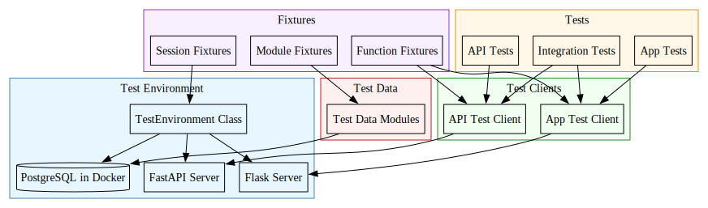

# Testing Infrastructure Overview

This document provides a comprehensive overview of the testing infrastructure in the ichrisbirch project. The testing infrastructure is designed to support automated testing of both the FastAPI-based backend API and the Flask-based frontend application.

## Table of Contents

1. [Testing Architecture](#testing-architecture)
2. [Test Environment Setup](#test-environment-setup)
3. [Test Data Management](#test-data-management)
4. [Test Clients](#test-clients)
5. [Fixtures](#fixtures)
6. [Writing Tests](#writing-tests)
7. [Related Documentation](#related-documentation)

## Testing Architecture

The testing infrastructure follows a layered approach:

The architecture ensures that:

1. Tests run in a controlled, isolated environment
2. Both API and App servers are available for testing
3. Test data is managed consistently
4. Authentication and authorization can be tested effectively

## Test Environment Setup

The test environment is managed by the `TestEnvironment` class, which handles:

1. Creating a PostgreSQL container in Docker
2. Starting the FastAPI server in a separate process
3. Starting the Flask server in a separate process
4. Setting up database schemas
5. Managing the lifecycle of these components

This ensures that tests run against real server instances, providing high confidence in test results.

## Test Data Management

Test data is managed through a set of modules in the `tests.test_data` package, with functions for:

1. Inserting test data for specific datasets
2. Deleting test data after tests
3. Special handling for test users to support authentication

## Test Clients

Test clients provide interfaces to interact with the API and App servers:

1. **API Test Client**: Based on FastAPI's TestClient
2. **App Test Client**: Based on Flask's FlaskClient and FlaskLoginClient

Both support authenticated and anonymous requests.

## Fixtures

The testing infrastructure provides fixtures at different scopes:

1. **Session-scoped**: Environment setup/teardown
2. **Module-scoped**: Database tables and user creation
3. **Function-scoped**: Test clients with different authentication levels

See the [fixtures documentation](fixtures.md) for more details.

## Writing Tests

See the [writing tests guide](writing_tests.md) for information on how to write effective tests using this infrastructure.

## Related Documentation

- [Test Fixtures](fixtures.md)
- [Test Data Management](test_data.md)
- [Test Environment Configuration](environment.md)
- [Writing Tests](writing_tests.md)
