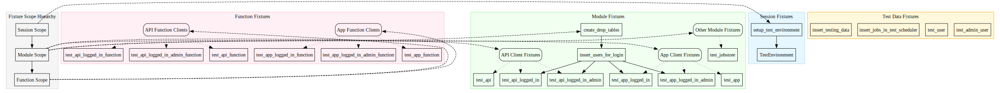

# Diagram Visualization Options

This document discusses alternatives to Mermaid for creating and visualizing diagrams in documentation, with a focus on options that work well within the Python ecosystem.

## Current Solution: Mermaid

[Mermaid](https://mermaid-js.github.io/mermaid/) is currently used for diagrams in our documentation. It offers:

- Markdown integration
- Simple text-based diagram definition
- Support in GitHub and many Markdown viewers
- Multiple diagram types (flowcharts, sequence diagrams, etc.)

However, Mermaid has some limitations:

- Limited layout control
- Can produce hard-to-read diagrams with complex relationships
- Limited styling options
- Performance issues with large diagrams

## Python-Based Alternatives

### 1. Graphviz with Python Bindings

[Graphviz](https://graphviz.org/) is a powerful graph visualization software with excellent Python bindings.

#### Installation

```bash
# Install Graphviz system package
brew install graphviz  # macOS
# or
apt-get install graphviz  # Ubuntu/Debian

# Install Python bindings
pip install graphviz
```

#### Benefits

- Much better automatic layout algorithms than Mermaid
- Multiple layout engines for different graph types
- Fine-grained control over node and edge appearance
- Can generate SVG, PNG, PDF, and other formats
- Highly optimized for complex diagrams

#### Example

```python
from graphviz import Digraph

dot = Digraph(comment='Test Fixtures')

# Create nodes
dot.node('SessionFixtures', 'Session Fixtures')
dot.node('ModuleFixtures', 'Module Fixtures')
dot.node('FunctionFixtures', 'Function Fixtures')

# Create edges
dot.edge('SessionFixtures', 'ModuleFixtures')
dot.edge('ModuleFixtures', 'FunctionFixtures')

# Save and render
dot.render('fixtures_hierarchy', format='svg')
```

### 2. Diagrams Library

[Diagrams](https://diagrams.mingrammer.com/) is a Python library for creating cloud system architecture diagrams.

#### Diagrams Installation

```bash
pip install diagrams
```

#### Diagrams Benefits

- Specifically designed for system architecture diagrams
- Clean, professional-looking output
- Easy to use Python API
- Many pre-defined icons and resources
- Good for deployment and infrastructure documentation

#### Diagrams Example

```python
from diagrams import Diagram, Cluster
from diagrams.programming.framework import Flask, FastAPI
from diagrams.programming.language import Python

with Diagram("Test Environment", show=False):
    with Cluster("Test Services"):
        api = FastAPI("API Server")
        app = Flask("App Server")
        db = Python("Database")

    api >> db
    app >> db
```

### 3. NetworkX with Matplotlib/Plotly

[NetworkX](https://networkx.org/) is a Python package for complex network analysis with visualization capabilities.

#### NetworkX Installation

```bash
pip install networkx matplotlib plotly
```

#### NetworkX Benefits

- Highly customizable graph layouts
- Interactive visualizations with Plotly
- Excellent for relationship-heavy diagrams
- Can perform advanced network analysis
- Integration with data science tools

#### NetworkX Example

```python
import networkx as nx
import matplotlib.pyplot as plt

# Create a directed graph
G = nx.DiGraph()

# Add nodes with groups
nodes = [
    ("session_env", {"group": "session"}),
    ("module_tables", {"group": "module"}),
    ("module_users", {"group": "module"}),
    ("function_client", {"group": "function"}),
]
G.add_nodes_from(nodes)

# Add edges
edges = [
    ("session_env", "module_tables"),
    ("module_tables", "module_users"),
    ("module_users", "function_client"),
]
G.add_edges_from(edges)

# Set positions using a layout algorithm
pos = nx.spring_layout(G)

# Draw the graph
plt.figure(figsize=(10, 8))

# Draw nodes
colors = ['lightblue', 'lightgreen', 'lightcoral']
for i, group in enumerate(['session', 'module', 'function']):
    nx.draw_networkx_nodes(
        G, pos,
        nodelist=[n for n, attr in G.nodes(data=True) if attr.get('group') == group],
        node_color=colors[i],
        node_size=1500,
        alpha=0.8,
        label=f"{group} fixtures"
    )

# Draw edges and labels
nx.draw_networkx_edges(G, pos, width=2, edge_color='gray')
nx.draw_networkx_labels(G, pos, font_size=12, font_family='sans-serif')

plt.title("Test Fixture Hierarchy")
plt.axis('off')
plt.legend()
plt.tight_layout()
plt.savefig("fixtures_hierarchy.png", format="PNG", dpi=300)
plt.show()
```

### 4. PyGraphviz

[PyGraphviz](https://pygraphviz.github.io/) provides a Python interface to the Graphviz graph visualization software.

#### PyGraphviz Installation

```bash
# Install Graphviz system package first
brew install graphviz  # macOS
# or
apt-get install graphviz  # Ubuntu/Debian

# Then install PyGraphviz
pip install pygraphviz
```

#### PyGraphviz Benefits

- Full access to all Graphviz features
- More direct control than the graphviz package
- Can handle very large graphs efficiently
- Good for programmatically generating complex diagrams

#### PyGraphviz Example

```python
import pygraphviz as pgv

G = pgv.AGraph(directed=True)
G.graph_attr['label'] = 'Test Fixtures Hierarchy'
G.node_attr['shape'] = 'box'
G.edge_attr['color'] = 'blue'

# Add nodes with styling
G.add_node("Session", style="filled", fillcolor="lightblue")
G.add_node("Module", style="filled", fillcolor="lightgreen")
G.add_node("Function", style="filled", fillcolor="lightcoral")

# Add edges
G.add_edge("Session", "Module")
G.add_edge("Module", "Function")

# Add subgraphs for clustering
session_cluster = G.add_subgraph(["Session"], name="cluster_session", label="Session Fixtures")
module_cluster = G.add_subgraph(["Module"], name="cluster_module", label="Module Fixtures")
function_cluster = G.add_subgraph(["Function"], name="cluster_function", label="Function Fixtures")

# Layout and output
G.layout(prog="dot")
G.draw("fixtures_hierarchy.svg", format="svg")
```

## Integration with Documentation

### Static Image Approach

1. Generate the diagrams as static images (SVG or PNG)
2. Include them in Markdown documentation with standard image syntax:

```markdown

```

### Interactive Solution

For interactive diagrams within documentation:

1. Use Plotly to create interactive diagrams
2. Export them as HTML files
3. Create an iframe to embed them in documentation

```markdown
<iframe src="../images/interactive_fixtures.html" width="100%" height="600px"></iframe>
```

## Workflow Integration

To integrate diagram generation into your workflow:

1. Create a `diagrams` module in your project
2. Implement Python scripts that generate diagrams
3. Add a build step that generates diagrams before documentation builds
4. Store generated images in a dedicated folder in docs

Example script structure:

```text
ichrisbirch/
└── docs/
    ├── diagrams/
    │   ├── generate_fixtures_diagram.py
    │   ├── generate_environment_diagram.py
    │   └── generate_all.py
    └── images/
        ├── fixtures_hierarchy.svg
        ├── environment_setup.svg
        └── ...
```

## Recommendation

Based on your requirements:

1. **For complex hierarchies and relationships**: Use Graphviz with Python bindings
2. **For system architecture diagrams**: Use the Diagrams library
3. **For interactive exploration**: Use NetworkX with Plotly

Graphviz is likely the best all-around solution for replacing the current Mermaid diagrams, as it provides much better automatic layout capabilities while still generating clean SVG output that can be included in documentation.

## Getting Started

To begin experimenting with Graphviz (recommended):

1. Install Graphviz and the Python bindings:

   ```bash
   brew install graphviz
   pip install graphviz
   ```

2. Convert one of your existing Mermaid diagrams to Graphviz:

   ```python
   from graphviz import Digraph

   # Create a new directed graph
   dot = Digraph(comment='Test Fixtures')
   dot.attr(rankdir='TB')  # Top to bottom layout

   # Add nodes for fixture types
   with dot.subgraph(name='cluster_session') as c:
       c.attr(label='Session Fixtures')
       c.node('setup_test_env', 'setup_test_environment')
       c.node('test_env', 'TestEnvironment')
       c.edge('setup_test_env', 'test_env')

   # Add more nodes and edges...

   # Save and render the graph
   dot.render('fixtures_hierarchy', format='svg')
   ```

3. Include the generated SVG in your documentation.
