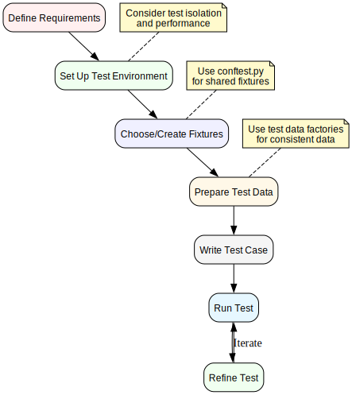

# Writing Tests

This document provides guidance on writing effective tests using the ichrisbirch project testing infrastructure.

## Test Organization

Tests in the project are organized by component and functionality:



## Test Types

The project uses several types of tests:

1. **API Tests**: Test API endpoints using FastAPI TestClient
2. **App Tests**: Test Flask routes and views using FlaskClient
3. **Integration Tests**: Test interactions between components
4. **Frontend Tests**: Test UI interactions using Playwright
5. **Model Tests**: Test model behavior and validation
6. **Unit Tests**: Test individual functions and methods

## Test File Naming

Test files follow a consistent naming pattern:

- API tests: `tests/ichrisbirch/api/endpoints/test_*.py`
- App tests: `tests/ichrisbirch/app/routes/test_*.py`
- Model tests: `tests/ichrisbirch/models/test_*.py`
- Utility tests: `tests/ichrisbirch/test_*.py` or `tests/utils/test_*.py`
- Script tests: `tests/scripts/test_*.py`

## Basic Test Structure

A typical test file includes:

1. Import statements
2. Test data fixture setup
3. Individual test functions
4. Helper functions (if needed)

Example:

```python
import pytest
from fastapi import status

from tests.utils.database import delete_test_data
from tests.utils.database import insert_test_data


@pytest.fixture(autouse=True)
def insert_testing_data():
    insert_test_data('events')
    yield
    delete_test_data('events')


def test_read_events(test_api_logged_in):
    response = test_api_logged_in.get('/events/')
    assert response.status_code == status.HTTP_200_OK
    assert len(response.json()) > 0


def test_create_event(test_api_logged_in):
    # Test implementation...
```

## Testing API Endpoints

### Basic API Test

```python
def test_api_endpoint(test_api_logged_in):
    response = test_api_logged_in.get('/endpoint/')
    assert response.status_code == status.HTTP_200_OK
    assert response.json() is not None
```

### Testing CRUD Operations

The project includes a `ApiCrudTester` utility for testing CRUD operations:

```python
from tests.ichrisbirch.api.endpoints.crud_test import ApiCrudTester

NEW_OBJ = schemas.EventCreate(
    name='Event 4',
    date=datetime(2022, 10, 4, 20, 0),
    venue='Venue 4',
    url='https://example.com/event4',
    cost=40.0,
    attending=False,
    notes='Notes for Event 4',
)

ENDPOINT = '/events/'

crud_tests = ApiCrudTester(endpoint=ENDPOINT, new_obj=NEW_OBJ)

def test_read_one(test_api_logged_in):
    crud_tests.test_read_one(test_api_logged_in)

def test_create(test_api_logged_in):
    crud_tests.test_create(test_api_logged_in)
```

## Testing App Routes

### Basic App Test

```python
def test_app_route(test_app_logged_in):
    response = test_app_logged_in.get('/route/')
    assert response.status_code == status.HTTP_200_OK
    assert b'Expected Content' in response.data
```

### Testing Form Submissions

```python
def test_form_submission(test_app_logged_in):
    form_data = {
        'field1': 'value1',
        'field2': 'value2',
        'action': 'submit',
    }
    response = test_app_logged_in.post('/form-route/', data=form_data)
    assert response.status_code == status.HTTP_200_OK
```

## Testing Frontend with Playwright

```python
def test_ui_interaction(page: Page):
    page.get_by_label('name').fill('Test Event')
    page.get_by_label('date').fill('2050-01-01')
    page.click('css=button[value="add"]')

    # Verify the result
    expect(page).to_have_title('Events')
```

## Testing Model Functions

```python
def test_model_method(test_user):
    result = test_user.validate_preferences(
        key='preferences',
        updated_preferences={'theme_color': 'blue'}
    )
    assert result is True  # or appropriate assertion
```

## Testing Authentication and Authorization

### Testing with Different User Types

```python
def test_admin_only_endpoint(test_api_logged_in_admin):
    response = test_api_logged_in_admin.get('/admin-only/')
    assert response.status_code == status.HTTP_200_OK

def test_admin_only_endpoint_unauthorized(test_api_logged_in):
    response = test_api_logged_in.get('/admin-only/')
    assert response.status_code == status.HTTP_401_UNAUTHORIZED
```

## Parameterized Tests

Use `pytest.mark.parametrize` for testing multiple scenarios:

```python
@pytest.mark.parametrize('category', list(TaskCategory))
def test_task_categories(test_api_logged_in, category):
    test_task = schemas.TaskCreate(
        name='Test Task',
        notes='Test Notes',
        category=category,
        priority=3,
    )
    response = test_api_logged_in.post('/tasks/', json=test_task.model_dump())
    assert response.status_code == status.HTTP_201_CREATED
```

## Testing Error Cases

```python
def test_invalid_input(test_api_logged_in):
    invalid_data = {'incomplete': 'data'}
    response = test_api_logged_in.post('/endpoint/', json=invalid_data)
    assert response.status_code == status.HTTP_422_UNPROCESSABLE_ENTITY
```

## Mocking External Dependencies

Use `unittest.mock` or `pytest-mock` to mock external dependencies:

```python
@patch('httpx.get')
def test_external_api(mock_httpx_get, test_api_logged_in):
    # Configure the mock
    mock_response = MagicMock()
    mock_response.status_code = 200
    mock_response.json.return_value = {'key': 'value'}
    mock_httpx_get.return_value = mock_response

    # Test the function that uses httpx.get
    response = test_api_logged_in.get('/endpoint-using-external-api/')
    assert response.status_code == status.HTTP_200_OK
```

## Testing Asynchronous Code

For testing async functions:

```python
import pytest_asyncio

@pytest_asyncio.fixture
async def async_client():
    # Setup async client...
    yield client
    # Teardown...

@pytest.mark.asyncio
async def test_async_function(async_client):
    result = await async_function()
    assert result == expected_value
```

## Testing Database Interactions

```python
def test_database_operation(test_api_logged_in):
    # Create an entity
    create_response = test_api_logged_in.post('/entity/', json={'name': 'Test'})
    assert create_response.status_code == status.HTTP_201_CREATED
    entity_id = create_response.json()['id']

    # Verify it's in the database
    get_response = test_api_logged_in.get(f'/entity/{entity_id}/')
    assert get_response.status_code == status.HTTP_200_OK
    assert get_response.json()['name'] == 'Test'
```

## Best Practices

1. **Test one thing per test function**: Each test should focus on a single behavior or condition
2. **Use descriptive test names**: Test names should clearly describe what they're testing
3. **Minimize test dependencies**: Avoid tests that depend on the outcome of other tests
4. **Clean up test data**: Always clean up any data created during tests
5. **Use appropriate fixtures**: Use the right scope for fixtures to optimize test performance
6. **Test edge cases**: Include tests for boundary conditions and error cases
7. **Use assertions effectively**: Make assertions specific and informative
8. **Avoid test logic**: Keep conditional logic in tests to a minimum
9. **Keep tests fast**: Optimize tests to run quickly
10. **Make tests deterministic**: Tests should produce the same result on each run

## Troubleshooting Common Test Issues

1. **Test data not available**: Ensure you have the right data fixtures
2. **Authentication failures**: Check that you're using the right test client
3. **Database errors**: Verify that database transactions are being managed properly
4. **Flaky tests**: Look for race conditions or external dependencies
5. **Slow tests**: Consider using more focused fixtures or optimizing test logic
