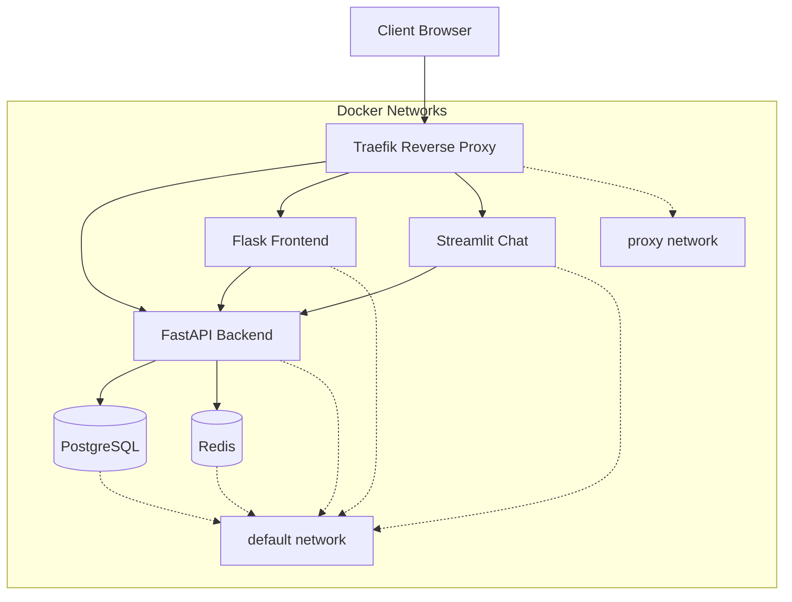

# Traefik Reverse Proxy Deployment Guide

This guide covers the complete deployment of Traefik reverse proxy for the iChrisBirch application, providing modern HTTPS termination, dynamic load balancing, and browser-trusted certificates for local development.

## 🎯 Overview

**Traefik v3.4** serves as the modern reverse proxy solution with a **simplified, unified CLI interface** that has **eliminated confusing command duplication**:

- **One command per operation**: `ichrisbirch dev start` (no more separate `traefik start dev`)
- **Dynamic service discovery** via Docker labels
- **Browser-trusted HTTPS** with mkcert for local development
- **Automatic certificate management** with fallback strategies
- **Centralized routing** for all application services
- **Production-ready** configuration with security best practices

### 🚀 CLI Simplification Benefits

The CLI has been **completely refactored** to provide a clean, professional interface:

**Before (Confusing):**

- `ichrisbirch traefik start dev` vs `ichrisbirch dev start` (did the same thing)
- Users needed to understand Traefik implementation details
- Inconsistent command patterns

**After (Clean & Simple):**

- **Single command**: `ichrisbirch dev start` uses Traefik + HTTPS by default
- **Hidden implementation**: Users don't need to know about reverse proxy details  
- **Consistent patterns**: All environments work the same way
- **Modern HTTPS by default**: No separate "traefik" commands needed

## 🏗️ Architecture Overview

### Traefik vs. Nginx

| Feature | Nginx (Legacy) | Traefik (Modern) |
|---------|----------------|------------------|
| Configuration | Static files | Dynamic Docker labels |
| SSL/TLS | Manual setup | Automatic certificate management |
| Service Discovery | Manual config updates | Automatic via Docker |
| WebSocket Support | Manual proxy_pass | Built-in with headers |
| Load Balancing | Manual upstream blocks | Automatic service discovery |
| Health Checks | External scripts | Built-in health monitoring |
| Hot Reload | Requires restart | Automatic configuration reload |

### Environment Separation

- **Development**: `*.docker.localhost` with mkcert browser-trusted certificates
- **Testing**: `*.test.localhost:8443` with isolated testing certificates  
- **Production**: `*.yourdomain.local` with production certificates

## 📁 Directory Structure

```text
deploy-containers/traefik/
├── certs/                           # SSL certificates
│   ├── dev.crt, dev.key            # Development environment (mkcert generated)
│   ├── testing.crt, testing.key    # Testing environment
│   └── prod.crt, prod.key          # Production environment
├── dynamic-dev/                     # Development-specific configuration
│   ├── tls.yml                     # Development TLS config
│   └── middlewares.yml             # Development middleware
├── dynamic-testing/                 # Testing-specific configuration
│   ├── tls.yml                     # Testing TLS config
│   └── middlewares.yml             # Testing middleware
├── dynamic-prod/                    # Production-specific configuration
│   ├── tls.yml                     # Production TLS config
│   └── middlewares.yml             # Production middleware
├── scripts/                        # Management utilities
│   └── ssl-manager.sh              # Certificate management (with mkcert support)
└── traefik.yml                     # Base Traefik configuration
```

## 🔧 Configuration Details

### Service Discovery

Traefik discovers services automatically via Docker labels:

```yaml
# Example service configuration
api:
  labels:
    - "traefik.enable=true"
    - "traefik.http.routers.api-dev.rule=Host(`api.docker.localhost`)"
    - "traefik.http.routers.api-dev.entrypoints=websecure"
    - "traefik.http.routers.api-dev.tls=true"
    - "traefik.http.routers.api-dev.tls.options=dev@file"
    - "traefik.http.routers.api-dev.middlewares=cors-dev@file,security-headers-dev@file"
    - "traefik.http.services.api-dev.loadbalancer.server.port=8000"
```

### Middleware Stack

Each environment includes:

- **CORS Headers**: Cross-origin request handling
- **Security Headers**: XSS protection, content security policy
- **Rate Limiting**: Request throttling (environment-specific)
- **WebSocket Support**: For Streamlit chat service
- **TLS Options**: Cipher suites and protocol versions

### Network Architecture



## 🌐 Environment URLs

### Development Environment

- **API**: <https://api.docker.localhost/>
- **App**: <https://app.docker.localhost/>
- **Chat**: <https://chat.docker.localhost/>
- **Dashboard**: <https://dashboard.docker.localhost/> (dev/devpass)

### Testing Environment

- **API**: <https://api.test.localhost:8443/>
- **App**: <https://app.test.localhost:8443/>
- **Chat**: <https://chat.test.localhost:8443/>
- **Dashboard**: <https://dashboard.test.localhost:8443/> (test/testpass)

### Production Environment

- **API**: <https://api.yourdomain.local/>
- **App**: <https://app.yourdomain.local/>
- **Chat**: <https://chat.yourdomain.local/>

> **Note**: Replace `yourdomain.local` with your actual production domain

## 🚀 Simplified Deployment Commands

### Modern CLI Interface (Post-Refactoring)

**All environments now use simplified commands** with Traefik + HTTPS by default:

```bash
# Start any environment (uses Traefik automatically)
ichrisbirch dev start               # Development
ichrisbirch testing start          # Testing  
ichrisbirch prod start             # Production

# Status and monitoring
ichrisbirch dev status             # Service status + URLs
ichrisbirch dev health             # Comprehensive health checks
ichrisbirch dev logs               # View service logs

# SSL certificate management
ichrisbirch ssl-manager generate dev    # Generate certificates (prefers mkcert)
ichrisbirch ssl-manager info dev        # Certificate information
ichrisbirch ssl-manager validate dev    # Validate certificates
```

### ❌ Removed Commands (No Longer Needed)

The following commands have been **eliminated to reduce confusion**:

- `ichrisbirch traefik start <env>` → Use `ichrisbirch <env> start`
- `ichrisbirch traefik stop <env>` → Use `ichrisbirch <env> stop`  
- `ichrisbirch traefik status <env>` → Use `ichrisbirch <env> status`
- `ichrisbirch traefik health <env>` → Use `ichrisbirch <env> health`
- `ichrisbirch traefik logs <env>` → Use `ichrisbirch <env> logs`

### Legacy CLI Commands (Deprecated)

```bash
# DEPRECATED - DO NOT USE
ichrisbirch traefik start <env>      # REMOVED - Use ichrisbirch <env> start instead
ichrisbirch traefik stop <env>       # REMOVED - Use ichrisbirch <env> stop instead
ichrisbirch traefik restart <env>    # REMOVED - Use ichrisbirch <env> restart instead
ichrisbirch traefik status <env>     # REMOVED - Use ichrisbirch <env> status instead
ichrisbirch traefik logs <env>       # REMOVED - Use ichrisbirch <env> logs instead
ichrisbirch traefik health <env>     # REMOVED - Use ichrisbirch <env> health instead
```

## SSL certificate management

ichrisbirch ssl-manager generate ENV   # Generate certificates
ichrisbirch ssl-manager validate ENV   # Validate existing
ichrisbirch ssl-manager info ENV       # Show certificate info

### Direct Script Usage

```bash
# Alternative: Use scripts directly
./deploy-containers/traefik/scripts/deploy.sh dev up
./deploy-containers/traefik/scripts/health-check.sh dev
./deploy-containers/traefik/scripts/ssl-manager.sh info all
```

### Docker Compose Commands

```bash
# Development
docker-compose -f docker-compose.dev.yml up -d

# Test  
docker-compose -f docker-compose.test.yml up -d

# Production
docker-compose up -d
```

## 🔒 SSL Certificate Management

### Automatic Certificate Generation

Certificates are generated automatically with appropriate Subject Alternative Names (SANs):

```bash
# Generate certificates for all environments
ichrisbirch ssl-manager generate all

# Generate specific environment
ichrisbirch ssl-manager generate dev
```

### Certificate Details

- **Algorithm**: RSA 2048-bit
- **Validity**: 365 days
- **SANs**: Wildcard domain + specific subdomains
- **Storage**: `deploy-containers/traefik/certs/`

### DNS Configuration

For local development, add entries to `/etc/hosts`:

```bash
# Development environment
127.0.0.1 api.docker.localhost
127.0.0.1 app.docker.localhost  
127.0.0.1 chat.docker.localhost
127.0.0.1 dashboard.docker.localhost

# Test environment
127.0.0.1 api.test.localhost
127.0.0.1 app.test.localhost
127.0.0.1 chat.test.localhost
127.0.0.1 dashboard.test.localhost
```

## 📊 Health Monitoring

### Comprehensive Health Checks

The health check system validates:

- **Docker Containers**: Status and health checks
- **DNS Resolution**: Local hosts and external domains
- **HTTP Endpoints**: API health, app frontend, chat service
- **WebSocket Support**: Streamlit WebSocket functionality
- **Dashboard Access**: Authentication and API availability

### Health Check Output

```bash
$ ichrisbirch traefik health dev

Health Check for dev Environment
========================================

[✓] Container: ichrisbirch-traefik-dev (Up 5 minutes)
[✓] Container: ichrisbirch-api-dev (Up 5 minutes (healthy))
[✓] DNS: api.docker.localhost found in /etc/hosts (127.0.0.1)
[✓] API Health: HTTP 200 (OK)
[✓] Chat Service WebSocket: HTTP 426 (WebSocket upgrade supported)
```

## 🔧 Troubleshooting

### Common Issues

1. **Port Conflicts**

   ```bash
   # Stop conflicting services
   docker stop $(docker ps -q --filter "name=ichrisbirch")
   ```

2. **DNS Resolution**

   ```bash
   # Add to /etc/hosts
   echo "127.0.0.1 api.docker.localhost" | sudo tee -a /etc/hosts
   ```

3. **Certificate Issues**

   ```bash
   # Regenerate certificates
   ichrisbirch ssl-manager generate all
   ```

4. **Container Health**

   ```bash
   # Check specific container logs
   ichrisbirch traefik logs dev api
   ```

### Verification Steps

1. **Network Connectivity**

   ```bash
   curl -k -I https://api.docker.localhost/health
   ```

2. **Container Status**

   ```bash
   ichrisbirch traefik status dev
   ```

3. **Certificate Validation**

   ```bash
   ichrisbirch ssl-manager validate dev
   ```

## 📈 Performance Considerations

### Development vs. Production

- **Development**: Optimized for fast iteration with file watching
- **Test**: Isolated with in-memory databases for speed
- **Production**: Optimized for performance with persistent storage

### Resource Allocation

- **Traefik**: Lightweight proxy with minimal overhead
- **API**: Multiple workers for production (4 workers)
- **App**: Gunicorn WSGI server for production
- **Database**: Production-tuned PostgreSQL settings

## 🔄 Migration from Nginx

### Advantages of Migration

1. **Dynamic Configuration**: No manual config file updates
2. **Automatic Service Discovery**: Docker label-based routing
3. **Built-in SSL**: Automatic certificate management
4. **WebSocket Support**: Native WebSocket proxying
5. **Health Monitoring**: Integrated health checks
6. **Hot Reload**: Configuration changes without restarts

### Legacy Support

The original nginx configuration remains available in `deploy-metal/` for compatibility and rollback scenarios.

## 🛠️ Advanced Configuration

### Custom Middleware

Add custom middleware in dynamic configuration files:

```yaml
# deploy-containers/traefik/dynamic/middlewares-dev.yml
http:
  middlewares:
    custom-headers:
      headers:
        customRequestHeaders:
          X-Custom-Header: "development"
```

### Load Balancing

For production scaling:

```yaml
labels:
  - "traefik.http.services.api.loadbalancer.server.port=8000"
  - "traefik.http.services.api.loadbalancer.healthcheck.path=/health"
  - "traefik.http.services.api.loadbalancer.healthcheck.interval=30s"
```

### Monitoring Integration

Traefik provides metrics endpoints for monitoring:

- **Prometheus**: `/metrics` endpoint
- **Dashboard**: Real-time service overview
- **Access Logs**: Structured request logging

## 📚 Additional Resources

- [Traefik Documentation](https://doc.traefik.io/traefik/)
- [Docker Compose Override](https://docs.docker.com/compose/extends/)
