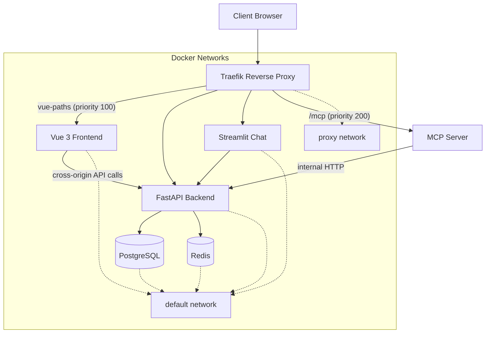

# Traefik Reverse Proxy Deployment Guide

This guide covers the complete deployment of Traefik reverse proxy for the iChrisBirch application, providing modern HTTPS termination, dynamic load balancing, and browser-trusted certificates for local development.

## 🎯 Overview

**Traefik v3.4** serves as the reverse proxy for all environments:

- **File provider routing** in `deploy-containers/traefik/dynamic/{dev,test,prod}/routing.yml`
- **Docker provider** for service discovery (container ports)
- **Browser-trusted HTTPS** with mkcert for local development
- **Generated routing** from canonical `vue-paths.txt` via `ich routing generate`
- **Separate CORS and security middlewares** per environment

## 🏗️ Architecture Overview

### Dual Provider Architecture

Traefik uses two providers simultaneously:

| Provider | Configures | Source |
| --- | --- | --- |
| **File provider** | Routers (rules, middleware, priorities) | `deploy-containers/traefik/dynamic/{env}/routing.yml` |
| **Docker provider** | Services (container ports, health) | Docker labels on containers |

File provider routers reference Docker-discovered services via `service: name@docker`. This separates routing logic (YAML files, diffable, generatable) from service discovery (Docker labels, minimal).

### Environment Separation

- **Development**: `*.docker.localhost` with mkcert browser-trusted certificates
- **Testing**: `*.test.localhost:8443` with isolated testing certificates
- **Production**: `*.ichrisbirch.com` via Cloudflare Tunnel (see [Homelab Deployment](homelab-deployment.md))

### Proxy Network Isolation

Each environment uses its own proxy network to avoid routing conflicts:

| Environment | Proxy Network | Traefik Constraint |
| --- | --- | --- |
| Development | `proxy-dev` | `traefik.environment=development` |
| Testing | `proxy-test` | `traefik.environment=testing` |
| Production | `proxy` | (no constraint needed) |

This allows all environments to run simultaneously. Traefik only discovers containers with matching environment labels.

## 📁 Directory Structure

```text
deploy-containers/traefik/
├── vue-paths.txt                    # Canonical list of Vue SPA route prefixes
├── generate-routing.sh              # Generates routing.yml for all 3 envs from vue-paths.txt
├── certs/                           # SSL certificates
│   ├── dev.crt, dev.key            # Development (mkcert generated)
│   ├── testing.crt, testing.key    # Testing
│   └── prod.crt, prod.key          # Production
└── dynamic/                         # Per-environment Traefik file provider configs
    ├── dev/
    │   ├── routing.yml             # Dev routers (generated)
    │   ├── middlewares.yml         # dev-cors, dev-security, dev-authelia-sim
    │   └── tls.yml
    ├── test/
    │   ├── routing.yml             # Test routers (generated)
    │   ├── middlewares.yml         # cors-test, security-headers-test, etc.
    │   └── tls.yml
    └── prod/
        ├── routing.yml             # Prod routers (generated)
        ├── services.yml            # Generated per deploy (blue/green color)
        ├── middlewares.yml         # cors-prod, security-headers-prod, etc.
        └── tls.yml
```

## 🔧 Configuration Details

### Routing (File Provider)

All routing rules live in `routing.yml` per environment. Docker labels only declare service ports:

```yaml
# Docker Compose label (minimal — just port discovery)
api:
  labels:
    - "traefik.enable=true"
    - "traefik.http.services.api.loadbalancer.server.port=8000"

# deploy-containers/traefik/dynamic/dev/routing.yml (full routing)
http:
  routers:
    api:
      rule: "Host(`api.docker.localhost`)"
      entrypoints: [websecure]
      service: api@docker
      middlewares: [dev-cors@file, dev-security@file, dev-authelia-sim@file]
      tls: {}
```

Routing files are generated from `vue-paths.txt` via `ich routing generate`.

### Middleware Stack

CORS and security headers are in **separate middlewares** to prevent chaining conflicts (wildcard `*` in one middleware overriding explicit lists in another). Each environment has:

| Middleware | Dev | Test | Prod |
| --- | --- | --- | --- |
| CORS | `dev-cors` | `cors-test` | `cors-prod` |
| Security Headers | `dev-security` | `security-headers-test` | `security-headers-prod` |
| Auth Simulation | `dev-authelia-sim` | `test-authelia-sim` | (Authelia ForwardAuth) |
| Rate Limiting | (none) | `rate-limit-test` | `rate-limit-prod` |
| WebSocket | (none) | `websocket-test` | (none) |

### Network Architecture


```mermaid
graph TB
    Client[Client Browser] --> Traefik[Traefik Reverse Proxy]
    Traefik -->|"vue-paths (priority 100)"| VUE[Vue 3 Frontend]
    Traefik --> API[FastAPI Backend]
    Traefik --> CHAT[Streamlit Chat]
    Traefik -->|"/mcp (priority 200)"| MCP[MCP Server]
    VUE -->|"cross-origin API calls"| API
    MCP -->|"internal HTTP"| API
    API --> DB[(PostgreSQL)]
    API --> CACHE[(Redis)]
    CHAT --> API

    subgraph "Docker Networks"
        Traefik -.-> PROXY[proxy network]
        API -.-> DEFAULT[default network]
        VUE -.-> DEFAULT
        CHAT -.-> DEFAULT
        DB -.-> DEFAULT
        CACHE -.-> DEFAULT
    end
```

### Path-Based Routing

Vue serves all pages at `app.docker.localhost`. The `vue-paths` router matches specific PathPrefix rules (generated from `vue-paths.txt`). Adding a new page:

1. Add the path to `deploy-containers/traefik/vue-paths.txt`
2. Run `ich routing generate` to update all three `routing.yml` files
3. Traefik's `file.watch=true` picks up the change automatically

### Dev Auth Simulation

In production, Authelia ForwardAuth injects `Remote-User` and `Remote-Email` headers after authentication. In dev, a Traefik middleware simulates this:

```yaml
# deploy-containers/traefik/dynamic/dev/middlewares.yml
dev-authelia-sim:
  headers:
    customRequestHeaders:
      Remote-User: "admin@icb.com"
      Remote-Email: "admin@icb.com"
```

This middleware is applied to the API router so Vue's cross-origin API calls are authenticated without running Authelia locally.

## 🌐 Environment URLs

### Development Environment

- **API**: <https://api.docker.localhost/>
- **App**: <https://app.docker.localhost/>
- **Chat**: <https://chat.docker.localhost/>
- **Dashboard**: <https://dashboard.docker.localhost/> (dev/devpass)

### Testing Environment

- **API**: <https://api.test.localhost:8443/>
- **App**: <https://app.test.localhost:8443/>
- **Chat**: <https://chat.test.localhost:8443/>
- **Dashboard**: <https://dashboard.test.localhost:8443/> (test/testpass)

### Production Environment

Production uses **Cloudflare Tunnel** for secure external access without exposing ports:

- **API**: <https://api.ichrisbirch.com/>
- **App**: <https://app.ichrisbirch.com/>
- **Chat**: <https://chat.ichrisbirch.com/>

Cloudflare handles TLS termination; Traefik receives HTTP internally and provides routing, CORS, security headers, and rate limiting.

> **Note**: See [Homelab Deployment Guide](homelab-deployment.md) for complete production setup

## 🚀 Simplified Deployment Commands

### Modern CLI Interface (Post-Refactoring)

**All environments now use simplified commands** with Traefik + HTTPS by default:

```bash
# Start any environment (uses Traefik automatically)
icb dev start               # Development
icb testing start          # Testing
icb prod start             # Production

# Status and monitoring
icb dev status             # Service status + URLs
icb dev health             # Comprehensive health checks
icb dev logs               # View service logs

# SSL certificate management
icb ssl-manager generate dev    # Generate certificates (prefers mkcert)
icb ssl-manager info dev        # Certificate information
icb ssl-manager validate dev    # Validate certificates
```

### Routing and Config Commands

```bash
# Generate routing files from vue-paths.txt
icb routing generate

# See fully merged Docker Compose output (debug overrides)
icb dev docker config [service]
icb testing docker config [service]
```

## SSL certificate management

```bash
icb ssl-manager generate ENV   # Generate certificates
icb ssl-manager validate ENV   # Validate existing
icb ssl-manager info ENV       # Show certificate info
```

## 🔒 SSL Certificate Management

### Automatic Certificate Generation

Certificates are generated automatically with appropriate Subject Alternative Names (SANs):

```bash
# Generate certificates for all environments
icb ssl-manager generate all

# Generate specific environment
icb ssl-manager generate dev
```

### Certificate Details

- **Algorithm**: RSA 2048-bit
- **Validity**: 365 days
- **SANs**: Wildcard domain + specific subdomains
- **Storage**: `deploy-containers/traefik/certs/`

### DNS Configuration

For local development, add entries to `/etc/hosts`:

```bash
# Development environment
127.0.0.1 api.docker.localhost
127.0.0.1 app.docker.localhost
127.0.0.1 chat.docker.localhost
127.0.0.1 dashboard.docker.localhost

# Test environment
127.0.0.1 api.test.localhost
127.0.0.1 app.test.localhost
127.0.0.1 chat.test.localhost
127.0.0.1 dashboard.test.localhost
```

## 📊 Health Monitoring

### Comprehensive Health Checks

The health check system validates:

- **Docker Containers**: Status and health checks
- **DNS Resolution**: Local hosts and external domains
- **HTTP Endpoints**: API health, app frontend, chat service
- **WebSocket Support**: Streamlit WebSocket functionality
- **Dashboard Access**: Authentication and API availability

### Health Check Output

```bash
$ icb dev health

Health Check for dev Environment
========================================

[✓] Container: icb-dev-traefik (Up 5 minutes)
[✓] Container: icb-dev-api (Up 5 minutes (healthy))
[✓] DNS: api.docker.localhost found in /etc/hosts (127.0.0.1)
[✓] API Health: HTTP 200 (OK)
[✓] Chat Service WebSocket: HTTP 426 (WebSocket upgrade supported)
```

## 🔧 Troubleshooting

### Common Issues

1. **Port Conflicts**

   ```bash
   # Stop conflicting services
   docker stop $(docker ps -q --filter "name=ichrisbirch")
   ```

2. **DNS Resolution**

   ```bash
   # Add to /etc/hosts
   echo "127.0.0.1 api.docker.localhost" | sudo tee -a /etc/hosts
   ```

3. **Certificate Issues**

   ```bash
   # Regenerate certificates
   icb ssl-manager generate all
   ```

4. **Container Health**

   ```bash
   # Check specific container logs
   icb dev logs api
   ```

### Verification Steps

1. **Network Connectivity**

   ```bash
   curl -k -I https://api.docker.localhost/health
   ```

2. **Container Status**

   ```bash
   icb dev status
   ```

3. **Certificate Validation**

   ```bash
   icb ssl-manager validate dev
   ```

## 📈 Performance Considerations

### Development vs. Production

- **Development**: Optimized for fast iteration with file watching
- **Test**: Isolated with in-memory databases for speed
- **Production**: Optimized for performance with persistent storage

### Resource Allocation

- **Traefik**: Lightweight proxy with minimal overhead
- **API**: Multiple workers for production (4 workers)
- **Database**: Production-tuned PostgreSQL settings

## 🔄 Migration History

Nginx was replaced by Traefik. The original nginx configuration remains in `deploy-metal/` (legacy, will be retired).

## 🛠️ Advanced Configuration

### Custom Middleware

Add custom middleware in dynamic configuration files:

```yaml
# deploy-containers/traefik/dynamic/dev/middlewares.yml
http:
  middlewares:
    custom-headers:
      headers:
        customRequestHeaders:
          X-Custom-Header: "development"
```

### Load Balancing

For production scaling:

```yaml
labels:
  - "traefik.http.services.api.loadbalancer.server.port=8000"
  - "traefik.http.services.api.loadbalancer.healthcheck.path=/health"
  - "traefik.http.services.api.loadbalancer.healthcheck.interval=30s"
```

### Monitoring Integration

Traefik provides metrics endpoints for monitoring:

- **Prometheus**: `/metrics` endpoint
- **Dashboard**: Real-time service overview
- **Access Logs**: Structured request logging

## 📚 Additional Resources

- [Traefik Documentation](https://doc.traefik.io/traefik/)
- [Docker Compose Override](https://docs.docker.com/compose/extends/)
